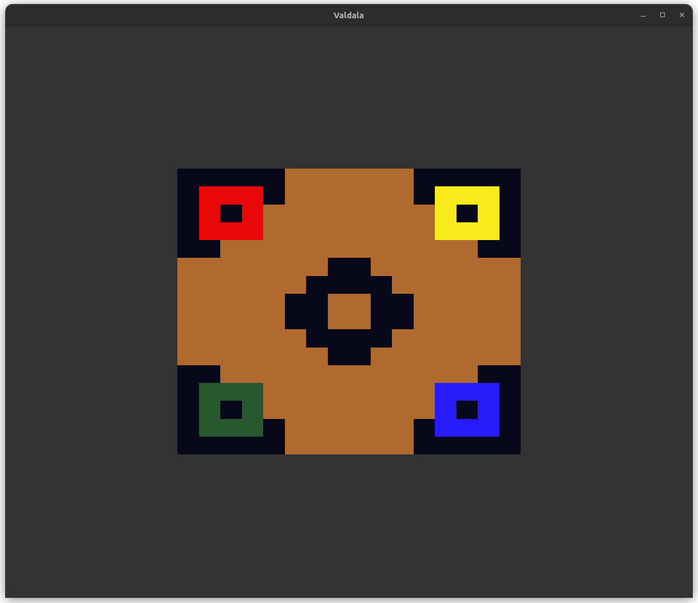

# Current state

Not much to look at, yet.
But the WebGPU bindings are working!




# Setup

## V

The 0.4.5 version of [V](https://vlang.io/) is used to compile the project.

## Compiler

V uses Tiny C Compiler (tcc) for development builds by default.
Unfortunately, tcc fails to compile the WebGPU headers.

Therefore, the build commands set [Clang](https://clang.llvm.org/) as the C compiler.


## Tools

Checking out the repository and submodules obviously requires [git](https://git-scm.com/).

Building wgpu-native requires a [Rust](https://www.rust-lang.org/) compiler and [make](https://www.gnu.org/software/make/).


## Dependencies

These dependencies are used to make windowing and graphics work:

| Name | Purpose | Installation |
| -- | -- | -- |
| [GLFW 3](https://www.glfw.org/)| window and input handling | system |
| [glfw3webgpu](https://github.com/eliemichel/glfw3webgpu)| create WebGPU surface from GLFW window | precompiled |
| [wgpu-native](https://github.com/gfx-rs/wgpu-native)| run WebGPU over system dependent graphics API | submodule |


## Tasks

[Task](https://taskfile.dev/) is used to run repetitive commands.
It's not required, but makes development easier.

Set up git submodules and compile required libraries:
```
task setup
```

Build and immediately launch the application:
```
task run
```

List other tasks:
```
task --list-all
```